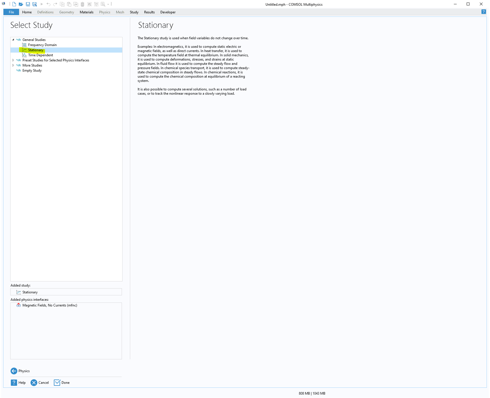

# ICESPICE Geant4 Simulation

This simulation is inspired by the geant4's advanced example named `purging_magnet`.

## Overview
ICESPICE (Internal Conversion Electron SPectrometer In Coincidence Experiments) is a mini-orange spectrometer in devolpment at the John D. Fox Lab at Florida State University. ICESPICE uses permanent magnets to separate electrons from other types of particles, reducing background noise and enhancing the study of internal conversion electrons. The concept was first introduced by [van Klinken (1972)](https://doi.org/10.1016/0029-554X(72)90416-8), with modern examples including [fIREBALL](https://doi.org/10.1016/j.nima.2023.168288) and the [Mini-Orange Spectrometer at CIAE](https://iopscience.iop.org/article/10.1088/1674-1137/40/8/086002/pdf).

The goal of this simulation is to import an external magnetic field from [COMSOL](https://www.comsol.com) and simulate electron trajectories and detector responses using [Geant4](https://geant4.web.cern.ch).

## Installation and Running

**Prerequisites:**
- Geant4 version: 11.2.0
- ROOT version: 6.30/06
- CMake version: 3.29.2

**Installing Geant4**
I have included a script to install Geant4 on MacOS. A similar script exists at [geant4_setup_tools](https://github.com/eli-temanson/geant4_setup_tools) for Ubuntu 22.04.

**Building and running the simulation:**
```bash
mkdir build
cd build
cmake ..
make
./ICESPICE
```

## Geometry

The geometry of ICESPICE is easily imported into Geant4 using [CADMESH](https://github.com/christopherpoole/CADMesh). From SolidWorks, the assembly geometry is exported to a .step file. This is then imported into [FreeCad](https://www.freecad.org/) and then exported as a .obj file. This is annoying but SolidWorks doesn't allow you to export an assembly as an .obj file. The .obj file can be easily read into geant4 using CADMESH. I had to change the groups ('g ') in the .obj file to objects ('o '). The name of the objects must not have spaces too.

## Scripts

Multiple scripts exist in different folders for the simulations of different purposes.


## COMSOL Magnetic Field Generation and Export

The first step is to design the mini-orange spectrometer in SolidWorks. For this project, SolidWorks 2020 was used with MMGS units (millimeters). When creating the model, carefully consider where you want to position the source and detector. In my case, I placed the spectrometer at the origin, with the source located along the +z direction.  

The following guide walks you through the process of building and exporting a magnetic field simulation in COMSOL 6.0.  

---  
### Steps

1: Create a new COMSOL file  
  

2: Set space dimension  
  

3: Select Physics (magnetic fields, no currents)  
  

4: Hit the **Study** button  
  

5: Select **Stationary** as the study type  
  

6: Get the design from SolidWorks using LiveLink  
  

7: Link the active SolidWorks design to the COMSOL simulation  
  

8: Create a box that will be used as the vacuum  
  

9: Define dimensions of the box  
  

10: Add material to the simulation  
  

11: Search for materials from the list and add them to the component  
  

12: Assign materials to components (use the scroll wheel to help with selecting the objects).  
Here I am selecting the magnets. You can also adjust the properties of the material here.  
  

13: Select the mounting material  
  

14: Select the vacuum  
  

15: Select the attenuator material  
  

16: Select the screw material  
  

17: Define cylindrical geometry for the magnetic field  
  

18: Define a new magnetic flux conservation  
  

19: Select the magnets, change the coordinate system, and set the flux direction  
  

20: Optionally ignore edges of holders (useful for complex geometry if meshing fails)  
  

21: Ignore edges of components using the 1060 Alloy material  
  

22: Build the mesh and adjust the element size as needed  
  

23: Compute the magnetic field (this may take a while depending on mesh size/complexity)  
  

24: Export the magnetic field as a `.csv` file.  
This includes spatial and vector field data at 0.5 mm intervals within a 10 cm × 10 cm × 14 cm region centered at the origin.  
⚠️ The output file is very large (>1 GB) and cannot be hosted on GitHub.  
The COMSOL output must be converted to the correct format (same as the `purging_magnet` example) for the code to read it.  
Use the script at `./scripts/comsol_to_geant_table.py`.  
  

25: Generate additional plots (e.g., heat map of the magnetic field)  
  